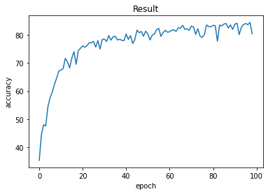

# ResNet - CIFAR 10 classification

## lecture
- https://www.youtube.com/watch?v=hqYfqNAQIjE&list=PLlMkM4tgfjnJ3I-dbhO9JTw7gNty6o_2m&index=11&ab_channel=SungKim
- https://www.youtube.com/watch?v=Qb_bYWcQXqY&list=PLQ28Nx3M4JrhkqBVIXg-i5_CVVoS1UzAv&index=25&ab_channel=DeepLearningZeroToAll
- https://www.youtube.com/watch?v=22w5RKZMo_g&list=PLQ28Nx3M4JrhkqBVIXg-i5_CVVoS1UzAv&index=26&ab_channel=DeepLearningZeroToAll
## Paper
- https://arxiv.org/pdf/1512.03385.pdf

## Link
- https://m.blog.naver.com/kimnanhee97/222007393892
- https://dnddnjs.github.io/cifar10/2018/10/09/resnet/
- https://www.notion.so/antemrdm/ResNet-d9a315b0a24f428aabe101300742cfba
## RUN
- qtconsole
```
%%time
%run ---.py
```

## Result

```text
...
Train Epoch: 97 [0/50000 (0%)]	Loss: 0.023100
Train Epoch: 97 [25600/50000 (51%)]	Loss: 0.028097
Test set(97): Average loss: 0.9737, Accuracy: 8371/10000 (84%)

Train Epoch: 98 [0/50000 (0%)]	Loss: 0.023232
Train Epoch: 98 [25600/50000 (51%)]	Loss: 0.020655
Test set(98): Average loss: 0.8725, Accuracy: 8449/10000 (84%)

Train Epoch: 99 [0/50000 (0%)]	Loss: 0.028336
Train Epoch: 99 [25600/50000 (51%)]	Loss: 0.032552
Test set(99): Average loss: 1.3383, Accuracy: 8049/10000 (80%)


CPU times: user 1h 17min 21s, sys: 35min 54s, total: 1h 53min 16s
Wall time: 1h 53min 27s
```


